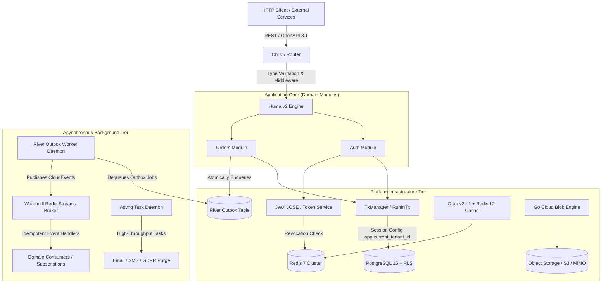

# Clericot: Enterprise Go Architecture & Framework

[](https://github.com/jrobertogarcia/clericot/actions/workflows/ci.yml)
[](https://goreportcard.com/report/github.com/jrobertogarcia/clericot)
[](LICENSE)

Clericot is a modular, production-grade Go enterprise application framework and architectural foundation engineered for high concurrency, strict data isolation, and operational reliability. It integrates native PostgreSQL Row-Level Security (RLS) multi-tenancy, a three-tier asynchronous messaging hierarchy (River transactional outbox, Asynq background tasks, Watermill Redis Streams event bus), an L1/L2 tiered caching engine (Otter v2 W-TinyLFU and Redis), Google Tink KMS envelope encryption, type-safe OpenAPI 3.1 REST transport via Huma v2 and Chi v5, and a deterministic 5-phase graceful shutdown coordinator.

---

## Architecture



---

## Prerequisites

- **Go**: 1.25+ (Toolchain 1.25.10+)
- **Container Runtime**: Docker and Docker Compose
- **Code Generation & Quality Tooling**:
  - `sqlc` (`github.com/sqlc-dev/sqlc`)
  - `golangci-lint` (v1.64.8+)

---

## Quickstart & Local Setup

### 1. Start Infrastructure Dependencies
Spin up PostgreSQL 16, Redis 7, MinIO, and Mailpit via Docker Compose:
```bash
docker compose up -d
```

### 2. Apply Database Migrations
Run schema and RLS migrations using the Clericot CLI tool:
```bash
go run cmd/clericot/main.go migrate up
```

### 3. Start the HTTP API Daemon
Start the API server listening on `http://localhost:8080`:
```bash
go run cmd/api/main.go
```

Key API endpoints:
- **Interactive Documentation**: `http://localhost:8080/docs`
- **OpenAPI 3.1 Specification**: `http://localhost:8080/openapi.json`
- **Liveness Probe**: `http://localhost:8080/livez`
- **Readiness Probe**: `http://localhost:8080/readyz`

### 4. Start the Background Worker Daemon
Start the background daemon running River outbox polling, Asynq task queues, and Watermill event consumers:
```bash
go run cmd/worker/main.go
```

---

## Testing & Code Quality

Clericot uses a containerized integration test harness built on Testcontainers. Tests utilize singleton container instances, zero-state transaction rollbacks (`RunTestInTx`), and deterministic generic test factories (`gofakeit/v7`).

### Execute Test Suite
Run unit and integration tests with the Go race detector:
```bash
go test -v -race ./...
```

### Run Static Analysis & Linters
Execute the configured `golangci-lint` rule set:
```bash
golangci-lint run ./...
```

---

## Platform Architecture & Subsystems

### 1. PostgreSQL Multi-Tenancy via Row-Level Security (RLS)
- **Engine-Level Isolation**: Enforced using PostgreSQL `FORCE ROW LEVEL SECURITY` across all tenant-scoped tables.
- **Connection Role Isolation**: Standard application connection pools connect using an unprivileged `app_user` role subject to RLS policies. Migrations execute under a privileged role.
- **Context Propagation**: Database transactions run through `TxManager.RunInTx`, setting `SELECT set_config('app.current_tenant_id', $1, true)` scoped to the active transaction.
- **Tenant Lifecycle**: Access policies require `status = 'active'`, allowing immediate suspension of compromised workspaces. Background Asynq workers handle automated GDPR tenant data purges.

### 2. Transactional Outbox & 3-Tier Messaging Hierarchy
- **Tier 1 (River Outbox)**: Postgres-native transactional outbox engine (`river.InsertTx`) ensuring zero dual-write anomalies for critical state transitions. Tables utilize tuned autovacuum settings and 5-minute retention windows.
- **Tier 2 (Asynq Task Queue)**: Redis-backed queue dedicated to high-frequency stateless tasks (notifications, webhooks, PDF generation, tenant purging) to protect PostgreSQL from table churn and WAL bloat.
- **Tier 3 (Watermill Event Bus)**: Universal message broker routing cross-domain and distributed CloudEvents over Redis Streams. Features Pending Entries List (PEL) crash recovery, stream trimming (`Maxlen: 100k`), `SET NX` consumer idempotency guards, and dead-letter routing via `middleware.PoisonQueue`.
- **Compliance Audit Trail**: Structured `audit.event.v1` CloudEvents staged atomically inside domain transactions to record actor, tenant, IP, and state diffs.

### 3. Tiered Caching Tier
- **L1 In-Memory Cache**: Powered by `maypok86/otter/v2` with W-TinyLFU adaptive eviction and a 2-minute fallback TTL for sub-microsecond in-process reads.
- **L2 Distributed Cache**: Redis-backed cache for distributed cluster consistency.
- **Stampede & Penetration Defense**: Uses `singleflight.Group` for thundering herd prevention, typed `CachedEntry[T]` envelopes with explicit empty flags to prevent cache penetration, tenant-scoped keys (`cache.TenantKey`), and Redis Pub/Sub invalidation broadcasting.

### 4. Cryptography & Security
- **Password Hashing**: OWASP RFC 9106 Argon2id parameters ($m=64\text{MB}, t=3, p=4$) combined with ingress rate limiting.
- **Envelope Encryption**: Google Tink (`KmsEnvelopeAead`) for multi-cloud envelope encryption of sensitive PII and secrets at rest (AWS KMS, GCP KMS, HashiCorp Vault).
- **Field-Level Encryption**: Native AES-256-GCM symmetric cipher for column-level encryption.
- **Hybrid Authentication**: Unified `AuthPrincipal` supporting JWX JOSE/JWT (with Redis JTI instant revocation blocklists) and SCS Redis-backed session cookies, exposed via Huma OpenAPI `SecuritySchemes`.
- **Distributed Rate Limiting**: Redis GCRA token bucket rate limiter (`redis_rate`) with an in-process fail-open fallback mechanism.

### 5. Lifecycle & Resilience
- **5-Phase Deterministic Graceful Shutdown**: Managed by the `Coordinator` with a strict 25-second total budget:
  1. *Phase 1: Readiness Draining* - Mark `/readyz` unhealthy and withdraw from ingress routing.
  2. *Phase 2: Ingress & Streaming Termination* - Gracefully stop HTTP servers and close active SSE/WebSocket connections via `StreamHub`.
  3. *Phase 3: Background Worker Drain* - Await completion of in-flight River, Asynq, and Watermill jobs.
  4. *Phase 4: Telemetry Flush* - Flush OpenTelemetry trace spans, metrics, and structured log buffers.
  5. *Phase 5: Resource Closure* - Close database connection pools, Redis clients, and object storage handles.
- **Asynchronous Health Probes**: `/livez` and `/readyz` health endpoints powered by `alexliesenfeld/health`, evaluating dependencies in the background to prevent probe storms.
- **In-Process Resilience**: Composable retry and circuit breaker policies using `failsafe-go`, configured to bypass rate limit statuses (HTTP 429).

---

## Developer CLI Scaffolding

The `clericot` developer CLI tool automates domain module scaffolding and migration lifecycle management.

### Scaffold a Domain Module
Generate a complete domain module adhering to the canonical 6-file architecture (`entity.go`, `repository.go`, `service.go`, `handler.go`, `worker.go`, `module.go`):
```bash
go run cmd/clericot/main.go module create billing
```

### Create a Database Migration
Generate a new timestamped Goose SQL migration file in `sql/migrations/`:
```bash
go run cmd/clericot/main.go migrate create add_invoices_table
```

---

## Documentation & Architectural References

For detailed design specifications, coding standards, and operational guidelines, refer to the project documentation:

- [Master Stack Standards & Technology Matrix](docs/architecture/stack-standards.md)
- [Standard Project Layout & Module Architecture](docs/architecture/project-layout.md)
- [The 15 Golden Rules of Clericot](docs/guidelines/golden-rules.md)
- [Distilled Engineering Lessons & Edge Cases](docs/guidelines/distilled-lessons.md)

---

## License

This project is licensed under the [MIT License](LICENSE).
