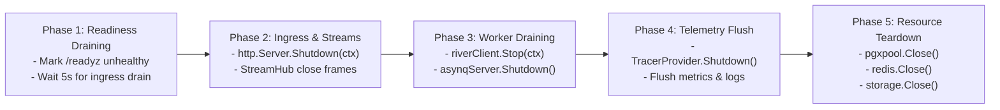

# Clericot: Enterprise Go Application Framework & Architecture Blueprint

Clericot is a modular enterprise application framework and architectural blueprint for Go (Go 1.25+). It is engineered for high-concurrency, multi-tenant SaaS environments, providing a production-grade foundation with strict separation of concerns, compile-time type safety, and zero framework lock-in.

---

## 1. System Architecture & Topology

The following diagram illustrates the component topology, transaction boundaries, and asynchronous data pipelines of the Clericot architecture.

```mermaid
flowchart TD
    subgraph Ingress ["Ingress & Transport Layer"]
        Client["HTTP Client / External Services"] -->|HTTP / JSON| Router["Chi v5 Router"]
        Router -->|Type Validation & OpenAPI 3.1| Huma["Huma v2 REST Engine"]
        Router -->|Livez / Readyz| HealthChecker["Async Health Checker (alexliesenfeld/health)"]
        Router -->|Stream Registry| StreamHub["StreamHub (WebSocket / SSE)"]
    end

    subgraph Modules ["Domain Application Modules (internal/modules/*)"]
        Huma --> AuthModule["Auth Module"]
        Huma --> OrderModule["Orders Module"]
        Huma --> CustomModule["Domain Modules (6-File Anatomy)"]
    end

    subgraph Platform ["Platform Foundation (internal/platform/*)"]
        AuthModule --> TxManager["TxManager (Savepoints & Hooks)"]
        OrderModule --> TxManager
        CustomModule --> TxManager

        TxManager -->|Context Injection: app.current_tenant_id| TenantEngine["PostgreSQL RLS Engine"]
        AuthModule --> TokenService["JWX v2 (JOSE / JWT) + Redis JTI Blocklist"]
        AuthModule --> SessionService["SCS v2 Session Manager"]

        CacheEngine["Two-Tier Cache (L1 Otter v2 + L2 Redis)"] --> RedisCluster[("Redis 7 Instance")]
        StorageEngine["Go Cloud Blob (S3 / GCS / MinIO)"] --> BlobStore[("Object Storage")]
    end

    subgraph DataLayer ["Persistence & Storage Layer"]
        TenantEngine --> PrimaryDB[("PostgreSQL 16 (app_user role)")]
        TxManager -->|river.InsertTx (ACID Outbox)| RiverTable[("river_job Table")]
        TokenService --> RedisCluster
        SessionService --> RedisCluster
    end

    subgraph Workers ["Asynchronous Processing Daemons (cmd/worker)"]
        RiverDaemon["River Outbox Worker"] -->|Poll & Claim Jobs| RiverTable
        RiverDaemon -->|Publish CloudEvents| WatermillBus["Watermill Event Bus (Redis Streams)"]
        WatermillBus -->|PEL Claiming / DLQ PoisonQueue| DomainConsumers["Domain Event Consumers"]
        AsynqDaemon["Asynq Task Server"] -->|Process Stateless Jobs| TaskWorkers["Mailer / Purge / Async Tasks"]
    end
```

---

## 2. Technology Matrix & Architectural Standards

Clericot adheres to strict technology standards defined in `docs/architecture/stack-standards.md`.

| Architectural Tier | Selected Standard | Package Path | Specification & Core Configuration |
| :--- | :--- | :--- | :--- |
| **HTTP Routing** | Chi v5 | `github.com/go-chi/chi/v5` | Standard `net/http` router with composable middleware, sub-routing, and zero magic. |
| **REST & OpenAPI** | Huma v2 | `github.com/danielgtaylor/huma/v2` | Code-first typed operations, auto OpenAPI 3.1 (`/openapi.json`), JSON Schema validation, and Swagger UI (`/docs`). |
| **Error Handling** | RFC 9457 Problem Details | `internal/platform/httperr` | Unified `httperr.Problem` implementing `huma.StatusError` and `huma.ErrorDetailer` returning `application/problem+json`. |
| **Health & Probes** | Health (Async Caching) | `github.com/alexliesenfeld/health`<br>`internal/platform/app` | Asynchronous non-blocking `/livez` and `/readyz` probes with cached background evaluation preventing connection pool storms. |
| **Streaming & Push** | StreamHub Tracker | `internal/platform/app` | Concurrent-safe `sync.Map` stream registry implementing `StreamCloser` (WebSocket `CloseNormalClosure` 1000 and SSE `event: close`). |
| **OLTP Persistence** | sqlc + pgx/v5 | `github.com/sqlc-dev/sqlc`<br>`github.com/jackc/pgx/v5` | Compile-time SQL-to-Go generation using native binary `pgxpool` connections and prepared statements. |
| **Dynamic Queries** | Bob | `github.com/stephenafamo/bob` | Dialect-specific parameterized SQL builder for multi-predicate search queries preserving PostgreSQL index scans. |
| **Transaction Manager** | RunInTx Pattern | `internal/platform/database` | Context-bound transaction coordinator with native `pgx/v5` savepoint nested transactions and detached rollback (`context.WithoutCancel`). |
| **Multi-Tenancy** | PostgreSQL RLS Engine | `internal/platform/tenant` | Kernel-level PostgreSQL Row-Level Security via parameterized `SELECT set_config('app.current_tenant_id', $1, true)` and `FORCE ROW LEVEL SECURITY`. |
| **Database Roles** | Dual Role Configuration | `internal/config` | Strict role separation: `DATABASE_URL` connects as unprivileged `app_user` (RLS enforced); `ADMIN_DATABASE_URL` connects as `postgres` for migrations. |
| **Schema Migrations** | Goose v3 | `github.com/pressly/goose/v3`<br>`github.com/jackc/pgx/v5/stdlib` | Versioned SQL/Go migrations embedded in binary (`embed.FS`) executed via `stdlib.OpenDBFromPool(pool)` with advisory locking. |
| **Transactional Outbox** | River | `github.com/riverqueue/river` | Postgres-native transactional outbox (`river.InsertTx`) with aggressive table autovacuum tuning and 5-minute retention. |
| **Distributed Event Bus** | Watermill | `github.com/ThreeDotsLabs/watermill` | Universal Pub/Sub with Redis Streams default (`watermill-redisstream`), PEL claiming, stream trimming (`Maxlen: 100k`), `SET NX` consumer idempotency, and DLQ routing (`middleware.PoisonQueue`). |
| **Compliance Audit Trail** | Outbox CloudEvents | `internal/platform/audit` | River Outbox staged `audit.event.v1` CloudEvents capturing Actor ID, Tenant, IP, and state diffs for SOC 2 and HIPAA compliance. |
| **Stateless Task Queue** | Asynq | `github.com/hibiken/asynq` | High-throughput Redis task queue for stateless jobs, retries, archived DLQ state, unique key tracking, and scheduled cron executions. |
| **Object Storage** | Go Cloud Blob | `gocloud.dev/blob` | Cloud-agnostic bucket abstraction (S3, R2, GCS, Azure, MinIO, Local FS) with tenant-prefixed presigned URLs and two-step confirmation. |
| **Mailer & Notifications** | go-mail + notify | `github.com/wneessen/go-mail`<br>`internal/platform/notify` | Asynq-queued notification engine for Email (SMTP/SES/Resend), SMS (Twilio), Webhooks, and Mailpit. |
| **Authentication** | Hybrid AuthPrincipal | `internal/platform/auth` | Unified context principal supporting Bearer JWTs (`jwx`) and Redis cookie sessions (`scs`), declaring Huma OpenAPI `SecuritySchemes`. |
| **Session Management** | SCS v2 | `github.com/alexedwards/scs/v2`<br>`github.com/alexedwards/scs/goredisstore/v2` | Redis-backed session middleware natively using `go-redis/v9` with immutable claims and CSRF protection. |
| **Token / Crypto / JWT** | JWX v2 | `github.com/lestrrat-go/jwx/v2` | Strict JOSE/JWT parsing, signing, verification with `jwk.Cache` auto-rotation and instant Redis JTI revocation blocklist (`SETEX auth:revoked:<jti>`). |
| **Password Hashing** | Argon2id (RFC 9106) | `golang.org/x/crypto/argon2` | OWASP RFC 9106 parameters (m=64MB, t=3, p=4) with ingress rate limiting to prevent CPU/memory exhaustion. |
| **Envelope Encryption** | Google Tink | `github.com/google/tink/v2/go`<br>`internal/platform/security` | Multi-cloud envelope encryption (`KmsEnvelopeAead`) for secrets and sensitive PII at rest via AWS KMS, GCP KMS, or HashiCorp Vault. |
| **Resilience (Local)** | Failsafe-Go | `github.com/failsafe-go/failsafe-go` | In-process composable policies (Retry, Circuit Breaker, Timeout, Bulkhead) configured to ignore HTTP 429 rate limit statuses. |
| **Resilience (Edge)** | Redis Rate | `github.com/go-redis/redis_rate/v10` | Distributed GCRA token bucket rate limiter over Redis with fail-open in-process fallback. |
| **Caching Tier** | Two-Tier Hybrid Cache | `internal/platform/cache` | Typed `CachedEntry[T]` envelope + contextual `cache.TenantKey(ctx, domain, id)` namespacing + L1 Memory (`otter/v2` W-TinyLFU, 2m fallback TTL) + L2 Redis + Singleflight + Redis Pub/Sub invalidation bus. |
| **Lifecycle Manager** | Phased Coordinator | `internal/platform/app` | Deterministic 5-phase graceful shutdown with a 25-second total budget synchronized with container orchestrator grace periods. |
| **Configuration** | Env v11 | `github.com/caarlos0/env/v11` | Direct environment variable parsing into typed structs with struct-tag validation. |
| **Logging & Tracing** | slog + OTel | `log/slog`<br>`go.opentelemetry.io/contrib/bridges/otelslog` | Stdlib structured JSON logging bridged with OpenTelemetry distributed trace contexts (5% head-based sampling). |
| **Testing Harness** | Testcontainers | `github.com/testcontainers/testcontainers-go` | Singleton `TestMain` Postgres/Redis/MinIO test containers + zero-state `RunTestInTx` auto-rollback runner and ephemeral test schemas. |
| **Developer CLI** | clericot (Cobra + Bubble Tea v2) | `github.com/spf13/cobra`<br>`charm.land/bubbletea/v2` | Unified `clericot` CLI for module scaffolding (`module create`), embedded Goose migrations (`migrate up`, `migrate create`), and seeders. |

---

## 3. Project Structure & Module Anatomy

The project follows the canonical layout detailed in `docs/architecture/project-layout.md`.

### 3.1 Directory Tree

```text
├── cmd/
│   ├── api/             # HTTP API entrypoint (main.go)
│   ├── worker/          # Background worker entrypoint (main.go - River, Asynq, Watermill relay)
│   └── clericot/        # Clericot developer CLI tool (Cobra + Bubble Tea v2)
├── internal/
│   ├── config/          # caarlos0/env configuration (DATABASE_URL, ADMIN_DATABASE_URL, Redis, S3)
│   ├── modules/         # Modular domain packages (auth, orders, etc.)
│   │   ├── auth/
│   │   │   ├── entity.go     # Pure domain entities, value objects, and error sentinels
│   │   │   ├── handler.go    # Huma v2 / Chi HTTP request/response handlers
│   │   │   ├── service.go    # Domain business logic & transaction orchestration
│   │   │   ├── repository.go # Persistence layer (maps sqlc & bob to entities)
│   │   │   ├── worker.go     # River & Asynq background job handlers
│   │   │   └── module.go     # Explicit constructor wiring (NewModule)
│   │   └── orders/
│   └── platform/        # Reusable core platform engines (domain-agnostic)
│       ├── app/         # 5-phase graceful shutdown coordinator, StreamHub & health probes
│       ├── auth/        # Hybrid AuthPrincipal (JWT via jwx + Redis cookie via SCS)
│       ├── audit/       # River Outbox audit.event.v1 CloudEvents schema & dispatcher
│       ├── httperr/     # RFC 9457 Problem Details error transformer (httperr.Problem)
│       ├── database/    # pgxpool, RunInTx transaction manager, Goose embedded runner
│       ├── tenant/      # PostgreSQL RLS session interceptors (set_config) & lifecycle management
│       ├── events/      # Watermill event bus, PoisonQueue DLQ & Outbox relay worker
│       ├── storage/     # gocloud.dev/blob cloud storage engine (S3/R2/GCS/MinIO)
│       ├── notify/      # wneessen/go-mail & multi-channel dispatcher
│       ├── cache/       # Two-tier cache (L1 otter/v2 + L2 Redis + Singleflight)
│       ├── security/    # Argon2id, Google Tink envelope KMS, AES-256-GCM, redis_rate
│       └── telemetry/   # OpenTelemetry tracing, metrics & slog bridge
├── sql/
│   ├── migrations/      # Versioned Goose SQL migrations (0001_init.sql, 0002_rls.sql)
│   └── queries/         # sqlc query definitions (users.sql, orders.sql)
├── tests/
│   ├── testsuite/       # Singleton TestMain harness (Postgres/Redis/MinIO testcontainers)
│   └── fixtures/        # Deterministic generics factories (gofakeit/v7) and seeders
├── docker-compose.yml   # Local development dependencies (Postgres, Redis, Mailpit, MinIO)
├── sqlc.yaml            # sqlc compiler configuration
├── Makefile             # Developer automation commands
└── go.mod
```

### 3.2 Canonical 6-File Module Anatomy

Every domain module under `internal/modules/<module_name>` implements the standard 6-file anatomy:

1. **`entity.go`**: Defines pure domain entities, value objects, validation methods, and domain error sentinels. Must contain zero persistence (`sqlc`, `pgx`) or HTTP transport (`huma`, `chi`) imports.
2. **`handler.go`**: Defines Huma v2 typed operations, input/output DTOs, and route definitions. Maps domain errors into RFC 9457 Problem Details via `httperr.Transform()`.
3. **`service.go`**: Implements core business logic, domain invariant enforcement, and multi-repository transaction orchestration via `TxManager.RunInTx`.
4. **`repository.go`**: Handles data access operations. Executes `sqlc` compiled queries or `Bob` dynamic SQL builders using `TxManager.GetDB(ctx)`, mapping database rows to clean domain entities.
5. **`worker.go`**: Implements River outbox job workers (`river.WorkerDefaults[T]`) and Asynq task handlers (`ProcessTask`) for asynchronous background processing.
6. **`module.go`**: Provides the explicit constructor function (`NewModule(...)`) that instantiates and wires the repository, service, and HTTP handler, registering endpoints with the Huma API.

---

## 4. Developer Quickstart & Command Reference

### 4.1 Prerequisites

- Go `1.25+`
- Docker and Docker Compose
- `sqlc` (`go install github.com/sqlc-dev/sqlc/cmd/sqlc@latest`)
- `golangci-lint` (`v1.64.8+`)

### 4.2 Local Environment Setup

1. Start development infrastructure dependencies (PostgreSQL, Redis, Mailpit, MinIO):
   ```bash
   make dev
   # or: docker compose up -d
   ```

2. Run embedded database migrations:
   ```bash
   go run cmd/clericot/main.go migrate up
   ```

3. Launch the HTTP API server:
   ```bash
   go run cmd/api/main.go
   ```
   The API server boots on port `8080` (configured via `APP_PORT`):
   - Interactive OpenAPI Documentation: `http://localhost:8080/docs`
   - OpenAPI 3.1 JSON Schema: `http://localhost:8080/openapi.json`
   - Liveness Probe: `http://localhost:8080/livez`
   - Readiness Probe: `http://localhost:8080/readyz`

4. Launch the asynchronous background worker daemon in a separate terminal:
   ```bash
   go run cmd/worker/main.go
   ```

### 4.3 Makefile Targets

| Target | Command | Purpose |
| :--- | :--- | :--- |
| `make dev` | `docker compose up -d` | Starts local development infrastructure containers. |
| `make test` | `go test -v -race ./...` | Runs all unit and integration tests with race detection. |
| `make lint` | `golangci-lint run ./...` | Executes static analysis and code linters across all packages. |
| `make generate` | `sqlc generate` | Compiles SQL queries in `sql/queries/` to type-safe Go structs. |
| `make clean` | `docker compose down -v` | Tears down local development containers and removes volumes. |

---

## 5. Developer CLI Tooling (`clericot`)

Clericot includes a dedicated developer CLI (`cmd/clericot`) built with Cobra and Bubble Tea v2 for domain scaffolding and migration management.

### 5.1 Domain Module Scaffolding

Scaffold a complete domain module adhering to the 6-file anatomy:
```bash
go run cmd/clericot/main.go module create billing
```
This generates:
- `internal/modules/billing/entity.go`
- `internal/modules/billing/repository.go`
- `internal/modules/billing/service.go`
- `internal/modules/billing/handler.go`
- `internal/modules/billing/worker.go`
- `internal/modules/billing/module.go`

### 5.2 Migration Tooling

Create a new timestamped Goose SQL migration:
```bash
go run cmd/clericot/main.go migrate create add_billing_invoices
```
This generates a new file in `sql/migrations/<timestamp>_add_billing_invoices.sql` with standard Goose up/down blocks.

Apply all pending migrations:
```bash
go run cmd/clericot/main.go migrate up
```

---

## 6. Deterministic 5-Phase Graceful Shutdown

Clericot implements a phased lifecycle coordinator (`internal/platform/app.Coordinator`) that guarantees zero dropped requests and zero corrupted background jobs during rolling deployments. The entire sequence executes within a strict **25-second total budget**, synchronizing with orchestrator termination grace periods (Kubernetes default: 30 seconds).



1. **Phase 1: Readiness Probe Flipping & Traffic Draining (5s Budget)**:
   The coordinator flips `/readyz` health checks to return `503 Service Unavailable`, signaling load balancers and Kubernetes ingress controllers to remove the instance from active endpoints while ongoing traffic drains.
2. **Phase 2: HTTP Server & Active Stream Teardown (10s Budget)**:
   Executes `http.Server.Shutdown(ctx)` to finish active requests. `StreamHub` sends clean termination frames (`websocket.CloseNormalClosure` 1000 / SSE `event: close`) to connected clients.
3. **Phase 3: Asynchronous Worker Draining (5s Budget)**:
   Stops River outbox workers (`riverClient.Stop(ctx)`) and Asynq task consumers (`asynqServer.Shutdown()`), allowing active in-flight jobs to complete while preventing new job pickups.
4. **Phase 4: Telemetry Buffer Flushing (2s Budget)**:
   Flushes all pending OpenTelemetry traces, spans, and metrics to collector endpoints via `TracerProvider.Shutdown(ctx)`.
5. **Phase 5: Persistent Storage & Pool Disposal (3s Budget)**:
   Closes primary PostgreSQL connection pools (`pgxpool.Close()`), Redis connection pools (`rdb.Close()`), and Cloud Blob storage buckets.

---

## 7. Testing Strategy & Isolation

Clericot employs a zero-state, high-performance testing strategy designed for both speed and reliability.

### 7.1 Singleton Testcontainers Harness

Integration tests leverage `tests/testsuite`, which provisions singleton PostgreSQL, Redis, and MinIO containers managed across all test packages via `TestMain`. Migrations are executed once against the shared instance.

### 7.2 Zero-State Transaction Runner (`RunTestInTx`)

Individual database tests run within isolated transactions that automatically roll back upon test completion via `testsuite.RunTestInTx(t, func(ctx context.Context, tx pgx.Tx) { ... })`. This provides sub-millisecond execution times without database state pollution.

### 7.3 Generics Test Data Factories

Test fixtures under `tests/fixtures` use type-safe Go generics and `gofakeit/v7` to generate deterministic synthetic entities with functional options:

```go
user := fixtures.NewUser(
    fixtures.WithTenantID("tenant_123"),
    fixtures.WithStatus("active"),
)
```

---

## 8. Architectural Guidelines & References

Detailed architectural documentation and governance standards are available in `docs/`:

- [Clericot Master Stack Standards & Specifications (2026)](docs/architecture/stack-standards.md)
- [Clericot Standard Project Layout & Module Architecture](docs/architecture/project-layout.md)
- [The 15 Golden Rules of Clericot](docs/guidelines/golden-rules.md)
- [Distilled Engineering Lessons & Edge Cases](docs/guidelines/distilled-lessons.md)

---

## 9. License

This project is licensed under the [MIT License](LICENSE).


